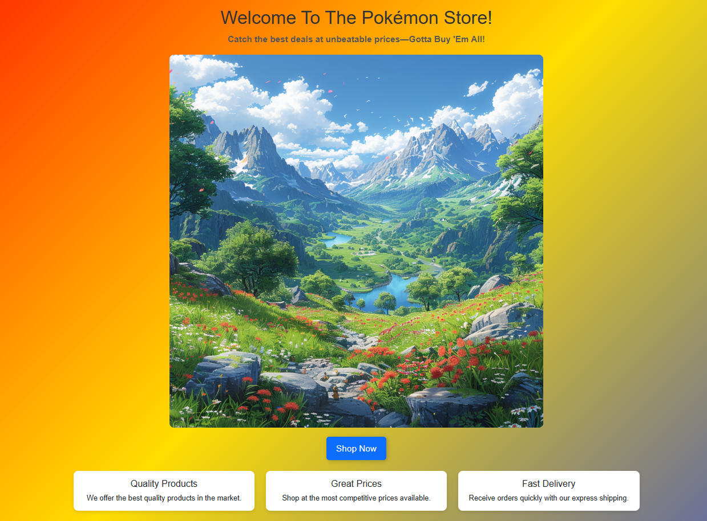
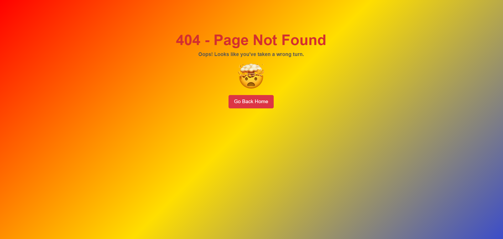

# Integrating Bootstrap with React

---

## Mockups




---

## Component Breakdown

*   **`App.jsx`:**
    *   **Purpose:**  The main application component, responsible for routing.
    *   **Functionality:**
        *   Uses `react-router-dom`'s `Routes` and `Route` components to define application routes.
        *   Renders the `HomePage` component when the path is `/`.
        *   Renders the `NotFound` component when the path is `/not-found`.
        *   Imports Bootstrap CSS for styling.

*   **`HomePage.jsx`:**
    *   **Purpose:** Displays the main landing page of the Pokémon store.
    *   **Functionality:**
        *   Presents a welcome message, a description, and a background image.
        *   Includes a "Shop Now" button that navigates to the `/not-found` route (currently).
        *   Features three cards highlighting key aspects of the store (Quality Products, Great Prices, Fast Delivery).
        *   Uses React Bootstrap components for layout and styling.
        *   Uses `useNavigate` hook to programmatically navigate to different routes.
    *   **Dependencies:**
        *   `HomePage.css` for custom styling.
        *   `bg-image.jpg` from the `assets` directory.

*   **`NotFound.jsx`:**
    *   **Purpose:**  Displays a "Page Not Found" message.
    *   **Functionality:**
        *   Shows a 404 error message and a descriptive text.
        *   Includes an image ( `exploding-head.png` ) to visually represent the error.
        *   Provides a "Go Back Home" button that links back to the homepage (`/`).
        *   Uses React Bootstrap components for layout and styling.
    *   **Dependencies:**
        *   `NotFound.css` for custom styling.
        *   `exploding-head.png` from the `assets` directory.

---

## Styling

*   **`index.css`:**
    *   Global styles for the entire application, including setting the background gradient.

*   **`HomePage.css`:**
    *   Custom styles specific to the `HomePage` component.

*   **`NotFound.css`:**
    *   Custom styles specific to the `NotFound` component.

---

## Assets

The `assets` folder contains static images used in the components:

*   `bg-image.jpg`:  Background image for the `HomePage`.
*   `exploding-head.png`: Image displayed on the `NotFound` page.

---

## Dependencies

*   **react:** JavaScript library for building user interfaces.
*   **react-dom:**  Provides DOM-specific methods that are useful for managing the app elements in the DOM.
*   **react-router-dom:** Provides the necessary components to navigate between the pages of your app.
*   **bootstrap:**  CSS framework for responsive and mobile-first front-end web development.
*   **react-bootstrap:** React components that implement Bootstrap's design.
*   

---

## Folder Structure
```
Oct24_Cohort_Module11_Lesson5_Assignment-1/
├── src/
│ ├──assets
│ ├── bg-image.jpg
│ ├── exploding-head.png
│ ├── components/ 
│ │ ├── HomePage.jsx 
│ │ ├── NotFound.jsx 
│ ├── styles/ 
│ │ ├── HomePage.css
│ │ ├── NotFound.css
│ ├── App.jsx
│ ├── index.css
│ ├── main.jsx
└──── index.html 
```